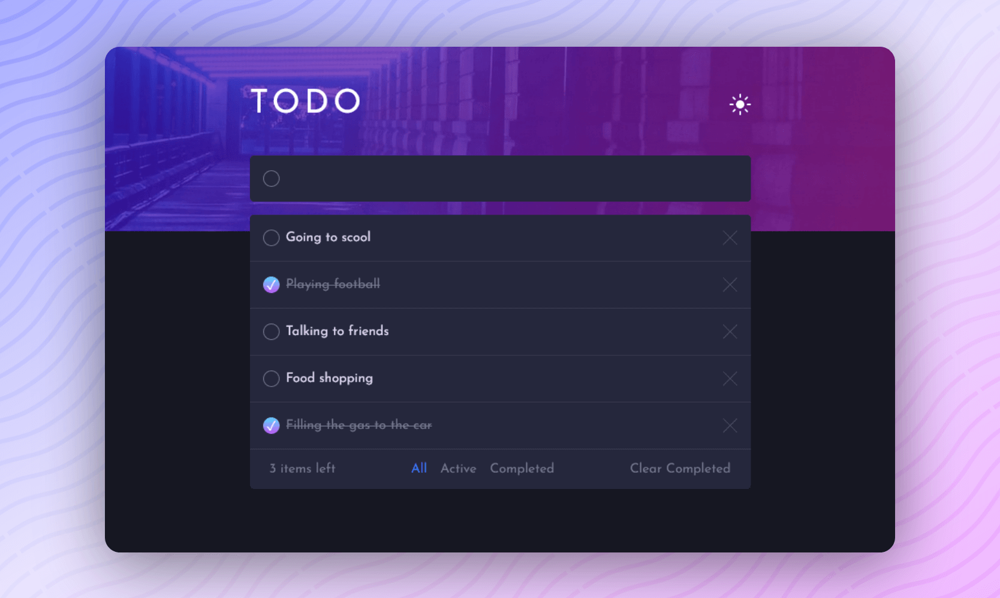

<div align="center">

# Todo app

</div>
<div align="center">

Challenge from [Frontend Mentor](https://www.frontendmentor.io/challenges)

<h2>

[🚀Live Site](https://todo-app-codepapa360.vercel.app)
||
[💡Frontend Mentor]()

</h2>
</div>

<!-- Badges -->
<div align="center">


<!-- Liceensee -->


</div>

<!-- Brief -->
<p align="center">

</p>

<!-- Screenshot -->
<a align="center" href="https://todo-app-codepapa360.vercel.app">



</a>

## Key Features

Users should be able to:

- Add new todos to the list
- Mark todos as complete
- Delete todos from the list
- Filter by all/active/complete todos
- Clear all completed todos
- Toggle light and dark mode
- View the optimal layout for the app depending on their device's screen size
- See hover states for all interactive elements on the page

## Continued development

- Drag and drop to reorder items on the list

## Built with

- [React](https://reactjs.org/) - JS library
- CSS
- HTML5
- Mobile-first workflow
- [Vite](https://vitejs.dev/) - A JavaScript module bundler and development server.

## What I Learned

In the process of building my first React project, I gained valuable insights and skills:

- **React Fundamentals:** I grasped the fundamental concepts of React, such as components, state, and props, which formed the backbone of my application.

- **State Management:** I explored state management in React using Redux Toolkit, enabling me to efficiently manage and update the application's data.

- **Modular CSS:** I adopted modular CSS, a new approach that allowed me to create well-structured and maintainable styles for my components, enhancing code organization and reusability.

- **UI/UX Design:** I ventured into UI/UX design principles, striving to create an intuitive and visually appealing interface for the app.

Building this Todo app marked a significant step in my React journey, and I'm excited to continue learning and applying my newfound knowledge to future endeavors.

## Installation

- Clone this repo:

```sh
git clone https://github.com/CodePapa360/React-Todo-App.git
```

- Install dependencies:

```sh
npm install
```

- Build command:

```sh
npm run build
```

- Live server:

```sh
npm run dev
```

## Author

<b>👤 Alamin</b>

- Twitter - [@CodePapa360](https://www.twitter.com/CodePapa360)
- LinkedIn - [@CodePapa360](https://www.linkedin.com/in/codepapa360)
- Frontend Mentor - [@CodePapa360](https://www.frontendmentor.io/profile/CodePapa360)
- Github: [@CodePapa360](https://github.com/codepapa360)

Feel free to contact me with any questions or feedback!

## Acknowledgments

This project was inspired by the "Todo App" challenge from Frontend Mentor. Special thanks to Frontend Mentor for providing the design and specifications for this project.

## License

This project is licensed under the [MIT](./LICENSE.md) License - see the LICENSE file for details.
